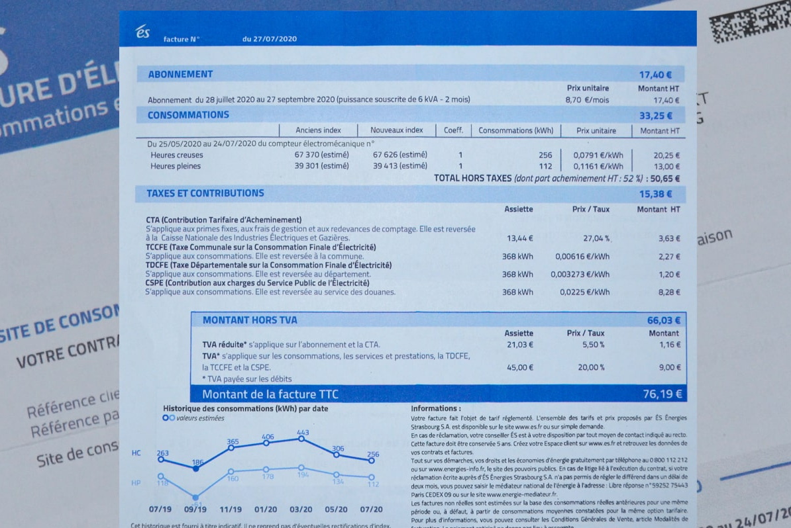
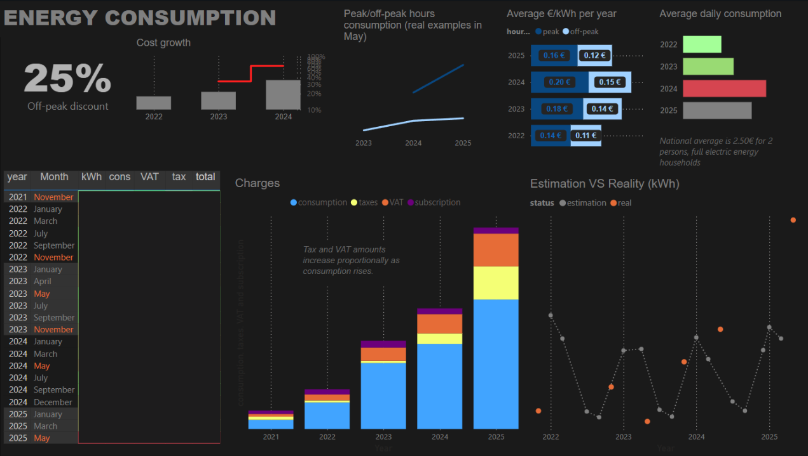

# ES Bills Parser

This project contains a Python script to parse ES electricity bills stored as PDF files in a folder, extracting key billing and consumption information into two CSV files.

---

## Overview

The script scans a specified folder containing PDF bills and extracts:

- Consumption details (real or estimated) for billing periods
- Total amount payable (or credit)
- Consumption split by hours (Heures Creuses - off-peak, Heures Pleines - peak)
- Pricing, taxes, subscription fees, and amounts before VAT

It uses PDF text extraction with [PyPDF2](https://pypi.org/project/PyPDF2/) and regular expressions to locate relevant data.

---

## Output CSV Files

1. **consumption_data.csv**

   Contains summary info per bill:

   | Column      | Description                             |
   | ----------- | ------------------------------------- |
   | filename    | PDF file name                         |
   | status      | Consumption status: `real` or `estimation` |
   | from date   | Start date of billing period (dd/mm/yyyy) |
   | to date     | End date of billing period (dd/mm/yyyy) |
   | kWh        | Total consumption in kilowatt-hours    |
   | days count  | Number of days in billing period       |
   | total       | Total amount payable (in euros), negative if credit |

2. **hours_data.csv**

   Details consumption and pricing by hours:

   | Column          | Description                            |
   | --------------- | ------------------------------------ |
   | name            | PDF file name                        |
   | hours type      | `"Heures creuses"` (off-peak) or `"Heures pleines"` (peak) |
   | €/kWh           | Price per kWh for the hour type       |
   | consumption (kWh)| Consumption in kWh for that hour type |
   | taxes (€)       | Taxes and contributions text line    |
   | tax (€)         | Tax value in euros                    |
   | without TVA     | Amount before VAT                     |
   | subscription    | Subscription fee                     |

---

## Usage

1. Set the `pdf_folder` variable in the script to the path of your folder containing ES bill PDFs.

2. Run the script. It will parse all PDFs (except `facture_26980081S.pdf`) and generate `consumption_data.csv` and `hours_data.csv` in the current directory.

---

## Requirements

- Python 3.x
- PyPDF2 (`pip install PyPDF2`)

---

## Notes

- The script relies on specific text patterns and French terms found in the bills.
- It handles dates in `dd/mm/yyyy` format.
- If any parsing errors occur, the script logs them but continues processing.

---

Feel free to modify the regex or extraction logic to adapt to different bill formats or additional data points.
